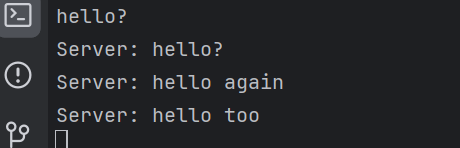
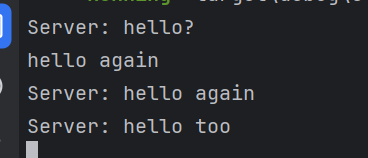
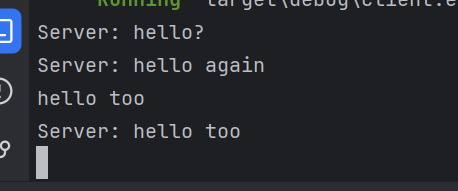
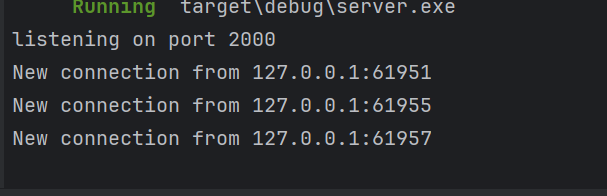

# Reflection

## 2.1. Original code of broadcast chat
### 1st Client POV:

### 2nd Client POV:

### 3rd Client POV:

### Server POV:

To run this program what we need first is to establish the connection by running the server first. The server will then listen from the port `2000` and awaits any connection from a client side, in this example I ran 3 clients to connect to the server, thus the server shows three new connections coming from those 3 new clients. Then the client can simply type in any form of message, the server will broadcast that output to itself and the other two clients too. Hence, after inputting three messages, each of the client has three broadcast output from the server.