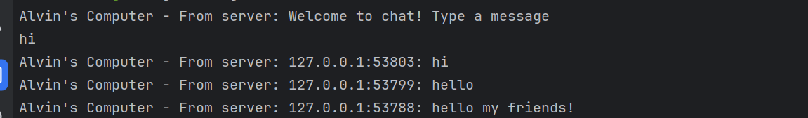
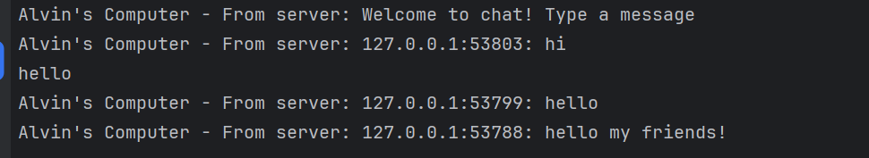
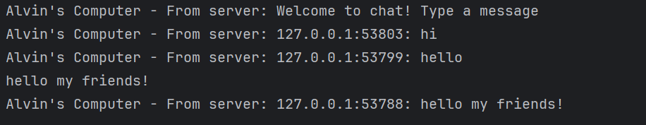

# Reflection

## 2.1. Original code of broadcast chat
### 1st Client POV:

### 2nd Client POV:

### 3rd Client POV:

### Server POV:

 
To run this program what we need first is to establish the connection by running the server first. The server will then listen from the port `2000` and awaits any connection from a client side, in this example I ran 3 clients to connect to the server, thus the server shows three new connections coming from those 3 new clients. Then the client can simply type in any form of message, the server will broadcast that output to itself and the other two clients too. Hence, after inputting three messages, each of the client has three broadcast output from the server.
## 2.2 Modifying the websocket port
To make sure the program still runs when the port is changed to `8080`, we need to modify the websocket for both the client and the server. Both the client and server also uses the same websocket of `tokio_websocket`. Here is where we need to modify it and what line shows that both server and client uses the `tokio_websocket` as their websocket
### where to modify server

### which line uses `tokio_websocket` in server

### where to modify client

### which line uses `tokio_websocket` in client

## 2.3 Small changes. Add some information to client
### first client

### second client

### third client

 
There are a few parts that I changed to achieve this, first in the `server` code, I added this line `let welcome_msg = format!("Alvin's Computer - From server: Welcome to chat! Type a message");` this is for the first line to show during the time the `client` code is runned. Next, I modified the print segment into `  let message = format!("Alvin's Computer - From server: {}: {}", addr, text);` Now instead of the previous message only I added the address and reformatted the statement, the message broadcast to the client will now follow that new format which includes the address as well. And for the `client` code I imported `send` and `next` for working with streams and sinks.
